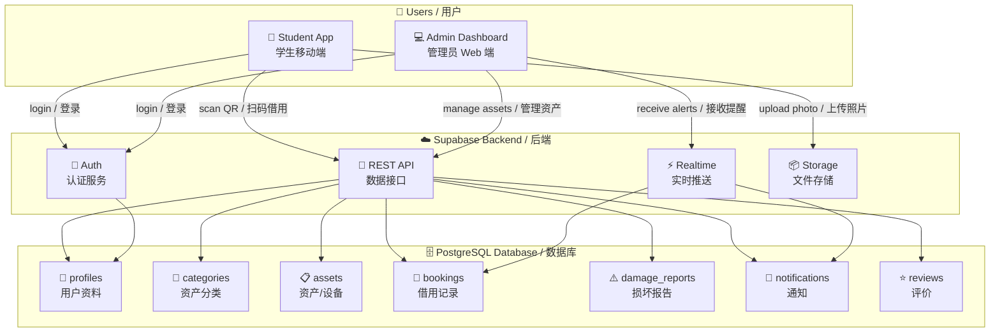
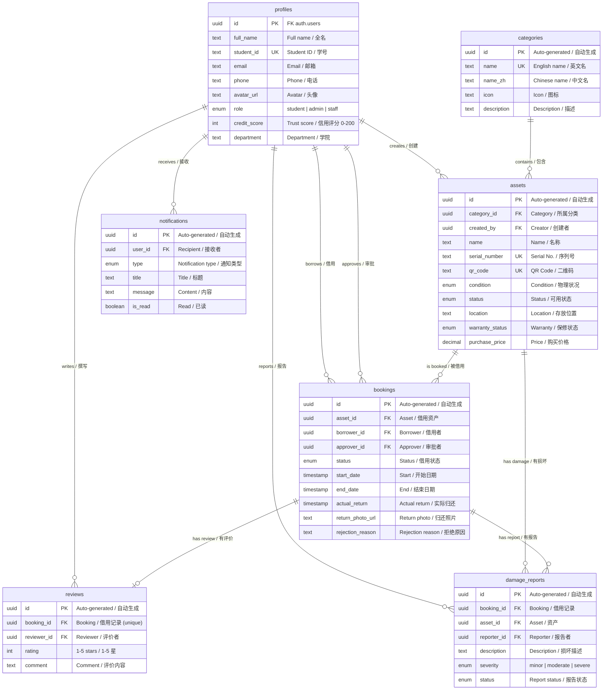
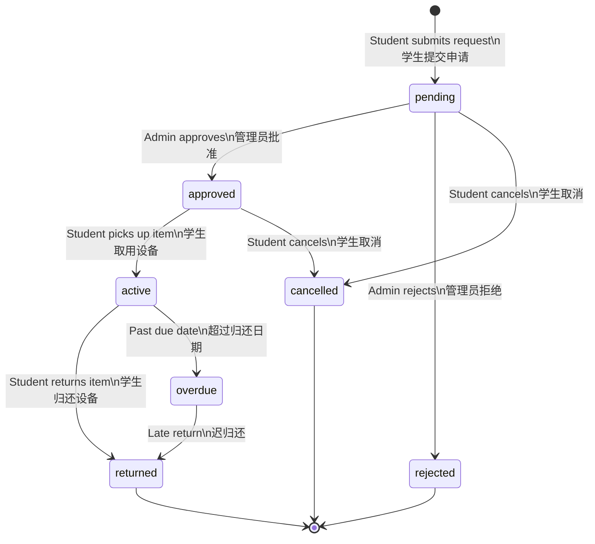

# UniGear Database Design

> Campus Asset Management System — 校园资产管理系统
> Author: Bosheng Su | Date: 2026-03-06

---

## 1. System Architecture Overview / 系统架构概览

---

## 2. Entity Relationship Diagram / 实体关系图

---

## 3. Booking Lifecycle / 借用生命周期

---

## 4. Table Relationships / 表关系

### One-to-Many / 一对多

| Parent / 父表 | Child / 子表 | Relationship / 关系 |
|---|---|---|
| `profiles` | `assets` | Admin creates assets / 管理员创建资产 |
| `profiles` | `bookings` | Student borrows, Admin approves / 学生借用，管理员审批 |
| `profiles` | `damage_reports` | User reports damage / 用户报告损坏 |
| `profiles` | `notifications` | User receives alerts / 用户收到通知 |
| `profiles` | `reviews` | User writes reviews / 用户撰写评价 |
| `categories` | `assets` | Category groups assets / 分类归组资产 |
| `assets` | `bookings` | Asset gets booked / 资产被多次借用 |
| `bookings` | `damage_reports` | Booking may cause damage / 借用可能产生损坏 |

### One-to-One / 一对一

| Table A | Table B | Note / 说明 |
|---|---|---|
| `bookings` | `reviews` | Each booking has at most one review / 每次借用最多一条评价 |

---

## 5. Enum Definitions / 枚举类型

### `user_role` — User Types / 用户类型

| Value | English | 中文 |
|-------|---------|------|
| `student` | Student | 学生 |
| `admin` | Administrator | 管理员 |
| `staff` | Lab Staff | 实验室工作人员 |

### `asset_condition` — Physical Condition / 物理状况

| Value | English | 中文 |
|-------|---------|------|
| `new` | Brand new | 全新 |
| `good` | Good condition | 良好 |
| `fair` | Acceptable | 一般 |
| `poor` | Heavy wear | 较差 |
| `damaged` | Needs repair | 损坏 |

### `asset_status` — Availability / 可用性

| Value | English | 中文 |
|-------|---------|------|
| `available` | Ready to borrow | 可借用 |
| `borrowed` | In use | 使用中 |
| `maintenance` | Under repair | 维修中 |
| `retired` | Decommissioned | 已退役 |

### `damage_severity` — Damage Level / 损坏等级

| Value | English | 中文 |
|-------|---------|------|
| `minor` | Cosmetic issue | 轻微 |
| `moderate` | Affects function | 中等 |
| `severe` | Unusable | 严重 |

---

## 6. RLS Policies / 行级安全策略

| Table / 表 | Read / 读 | Write / 写 | Update / 改 | Delete / 删 |
|-------|------|-------|--------|--------|
| `profiles` | All users / 所有用户 | Auto on signup / 注册自动 | Own only / 仅自己 | ✗ |
| `categories` | All users / 所有用户 | Admin only / 仅管理员 | Admin only / 仅管理员 | Admin only / 仅管理员 |
| `assets` | All users / 所有用户 | Admin only / 仅管理员 | Admin only / 仅管理员 | Admin only / 仅管理员 |
| `bookings` | Own + Admin / 自己+管理员 | Own only / 仅自己 | Own + Admin / 自己+管理员 | ✗ |
| `damage_reports` | Own + Admin / 自己+管理员 | Reporter / 报告者 | Admin only / 仅管理员 | ✗ |
| `notifications` | Own only / 仅自己 | Admin only / 仅管理员 | Own (mark read) / 标记已读 | ✗ |
| `reviews` | All users / 所有用户 | Own only / 仅自己 | Own only / 仅自己 | ✗ |

---

## 7. Design Notes / 设计说明

| Decision / 决策 | Reason / 原因 |
|---|---|
| UUID primary keys / UUID 主键 | Globally unique, safe for mobile offline sync / 全局唯一，适合移动端离线同步 |
| Separate `damage_reports` / 独立损坏表 | Keeps `bookings` clean, one booking can have multiple damage records / 保持借用表干净 |
| `credit_score` on profiles / 信用评分 | Admins use this when reviewing borrow requests / 管理员审批时参考 |
| `qr_code` on assets / 二维码字段 | Students scan QR codes to start borrowing / 学生扫码借用的核心功能 |
| `return_photo_url` / 归还照片 | Proof of condition at return, protects both sides / 归还状况证明，保护双方权益 |
| Bilingual `name`/`name_zh` / 双语字段 | Supports English and Chinese UI / 支持中英文界面 |

---

*For the visual ER diagram, paste `er-diagram.dbml` into [dbdiagram.io](https://dbdiagram.io) and export as PNG.*
